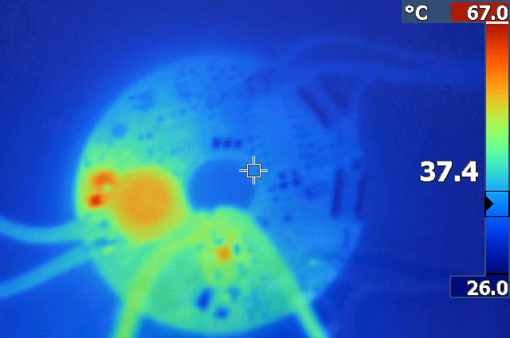
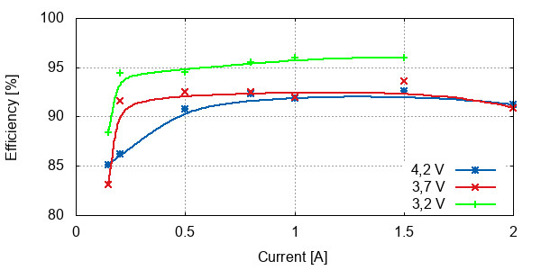
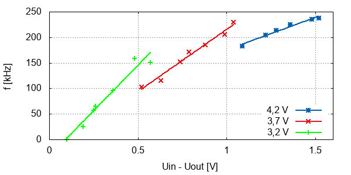
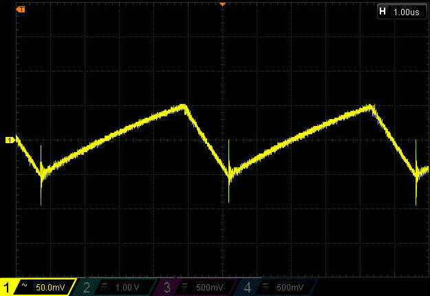
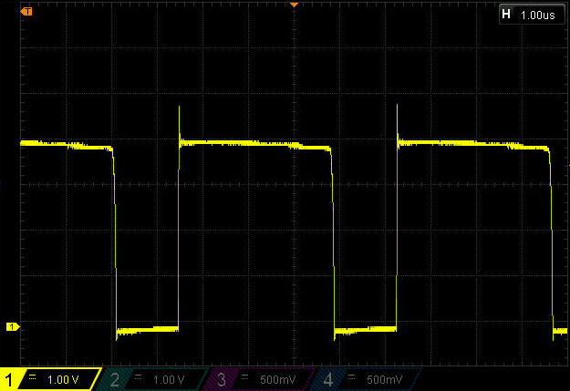
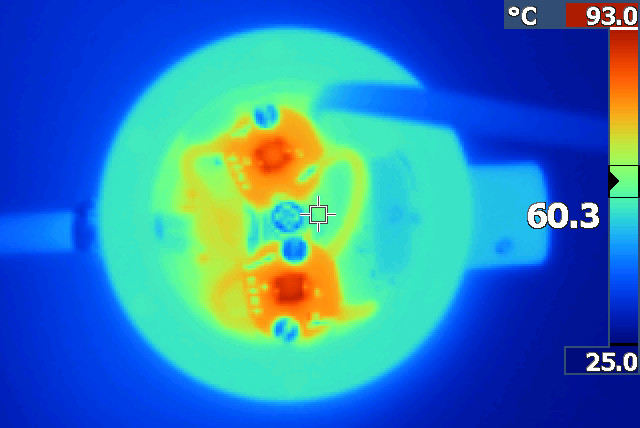

Measurements
============

Electrical and heat
-------------------
As the headlamp was build for my bachelor thesis, I went through couple of
measurements of various parameters.

The most important part is the LED driver. Its efficiency and heat management
defines most of the headlamp parameters.

When tested under maximum load 4,2 V input, 2 amps load, the driver temperature
settles at 67 degrees Celsius.

The measured efficiency is over 90 % for currents over 0,5 A over the whole
input voltage range and it's topping on 96,9 %.

As the buck driver is hystersis driven, the frequency is not stable, but it varies
with input and output voltage significantly.

The driver supply voltage can as low as 0,1 V over output voltage. 3,2 V battery
can therefore run XP-L2 on 2 Amps without any problem (when ignoring voltage drop
on wires).

As the comparator driving the switching transistor is open drain, there is non
zero current flowing through pull up and feedback resistor to ground when
the lamp is off. The measured power off current is 27 uA for the whole headlamp
with two drivers and MCU in sleep.

As the buck driver is in switching configuration, the current through LED is
not stable, but it's oscillating around the configured value with about
300 mA ripple.

As there are no ideal components out there, the switching is not as smooth as
it could be. The diode recovery time is non zero and when the switch occurs,
voltage peak appears on the coil. The following image shows the issue (voltage
in the point where transistor, diode and coil connect together).

These peaks can get to the supply voltage, at the beginning I was using
diode detector to avoid voltage drops on MCU power rail, but the peaks
were slowly charging the capacitor on MCU side, voltage was rising. The result
was voltage break down of the opamp. After replacing the detector with RC
low pass, the problem was fixed.

When the lam is running on full power, LEDs heat up to about 100 degree Celsius
before the body goes to 60 degrees and the temperature control kicks in.
This could be heavily improved by using cooper heatsink.

Light
-----
TODO
