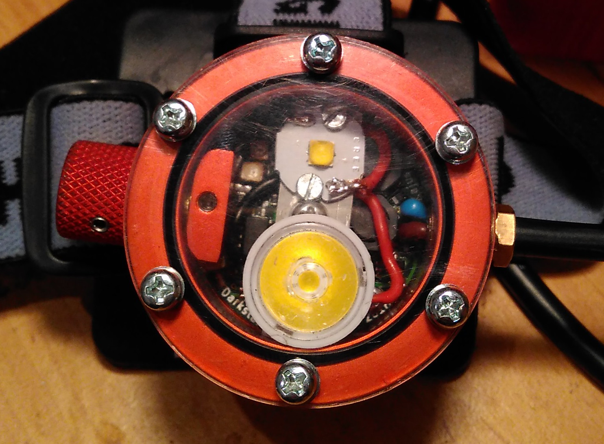

DarkStar Mk.II
==============

Small lightweight, water/mud/shock/bomb proof headlamp with bat roasting
light output and Scurion like body for 1/8 of the price. If you are caver,
mine explorer, biker, etc. with hacker soul, this is a way to go!

Features
--------
* Two high power high efficiency XP-L2 LEDs and two low power (e.g. red + UV).
* Up to 869 ANSI lumens (with 80 CRI 4000 K LEDs).
* Anodized aluminium alloy body.
* 3D printed battery box.
* Waterproof up to 2 (tested) meters (IPx8).
* Custom high efficiency LED drivers - up to 96 %.
* Up to 2 Amps per LED.
* Runs on single Li-Ion cell, two are recommended for higher run times.
* Thoroughly tested - see [Measurements](./Measurements.md) for more details.
* Simple API for writing custom user modes.
* Temperature and voltage limits to avoid sudden power off or overheating.
* Long run time (over 30 days on lowest mode, over 1,5 hour on full power - for two 3400 mAh cells).
* Low power off current (27 uA), no need to unplug battery after use.
* Easily replaceable LEDs.
* Weights only 277 grams with two 18650 cells.
* Automated light control based on amount of reflected light (EXPERIMENTAL).
* Custom li-ion protection circuit - up to 7 Amps.

Weight
------
* Lamp: 92 g
* Battery box: 50 g
* 2x18650 battery pack: 97 g
* Head strap: 38 g

HowTo
=====
Directories
-----------
* **avr** Source code and hex files for AVR
* **pcb** circuit diagrams, PCBs, gerber files and BOM for electrical parts
* **mechanical** Mechanical BOM, drawings, STLs

Electronics
-----------
The LED drivers were custom designed from elementary components, no integrated
LED solution was used. It's based on hystersis driven buck converter with current
feedback.

The current is sensed by 0,056 ohm resistor, voltage across this resistor is
amplified by opamp and fed to the comparator. The comparator is a brain of the
driver. When the measured voltage is higher than reference voltage generated by
MCU, comparator turns the MOSFET off, current drops below hystersis, MOSFET is turned on
and the cycle repeats. Nothing fancy, but quite simple and cheap.
Only few parts are required and measured efficiency is reaching 96 %. Over 90 \% for
currents over 0,5 A for whole supply voltage range allowed.
Check [Measurement](./Measurements.md) for more details.
The maximal current allowed is 2 Amps. It should be possible to get much higher
currents by choosing better (bigger and more expensice) inductors and transistors.

Disadvantage of such design is a limited lowest possible current, it can't go
below half of the hystersis current. For this reason 10-100 % output is constant
current driven, 0-10 % is controlled by additional PWM.

Software
--------

The brain of the lamp is Attiny 841, it handles key presses, reference voltage
generating, etc. To make it simpler to program I use optiboot arduino compatible
bootloader though there is no arduino code included in the project except
the bootloader itself.

To make it simpler to write your own control modes, most of the code is just a library
controlling the hardware and providing few quite low level functions to user. It
takes care of reading buttons, generating reference voltages for LED drivers, etc.

It also contains automated light control (PI regulator). The light is measured
by phototransistor and the difference between the measured value and value
required is run through the PI regulator. Result is the applied to reference
voltage generator. This feature is quite EXPERIMENTAL and doesn't work
well for caving when the lamps gets covered in mud.

The rest is the user mode. Check [simple mode](./avr/src/modes/simple.c) to see
how simple it can get. All relevant header are included. See [HowTo](./HowTo.md)
for more details on programming and stuff.

The caving mode controls are described in [User guide](./User_guide.md).

Mechanical
----------
The body is machined on a lathe from 6063 aluminium alloy. No fancy expensive
tools except lathe and drill press are required to make the lamp.

Top cover is made from polycarbonate sheet, cable and control rods bushings are
made from brass. The whole thing is sealed with O-rings. See the [BOM](./mechanical/BOM.md)
for more details.

The battery box is designed to be printed on any 3D printer. I would suggest
using ABS and painting the resulting print with ABS juice to get is as
waterproof as possible.

Lenses
------
the wide beam led can be used without lenses, the beam is wide enough for my
needs, for the narrow beam led you can buy any compatible lens that fits inside
the body. I used [17mm 10deg lens]
(http://www.aliexpress.com/item/free-shipping-cree-xp-g-lens-diameter-17mm-smooth-surface-with-stand-condenser-lenses-10-deg/777222733.html)

License
=======

The source code is licenced under [GNU GPL v2](./avr/LICENSE). The mechanical and
electrical design is licensed under [CERN OHL v.1.2](LICENSE).
